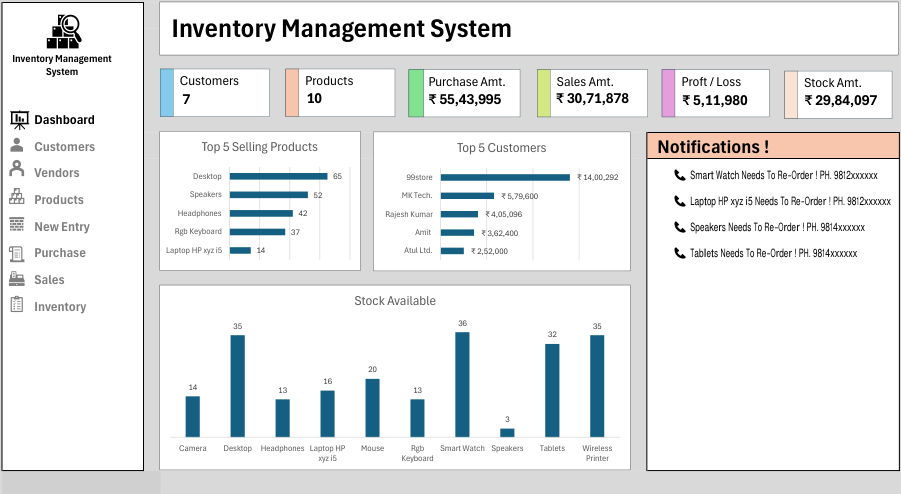
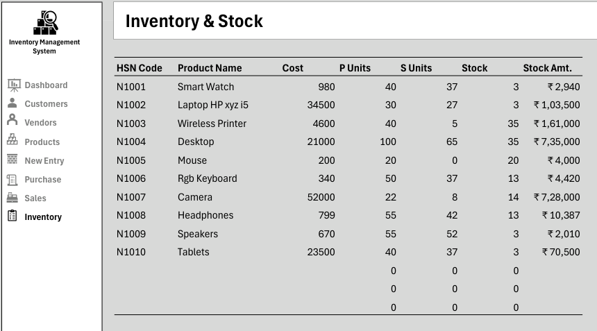
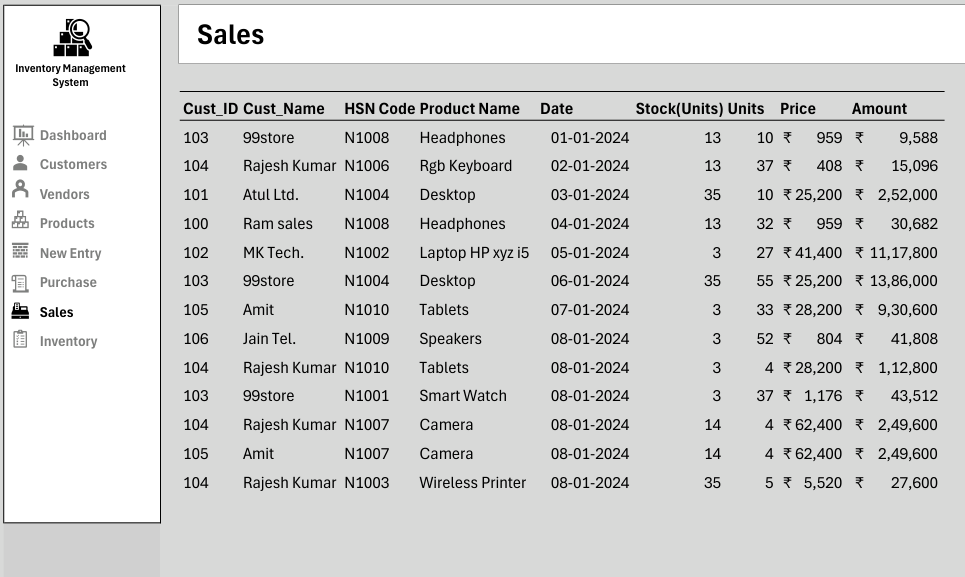
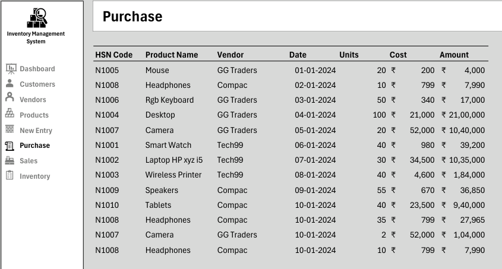
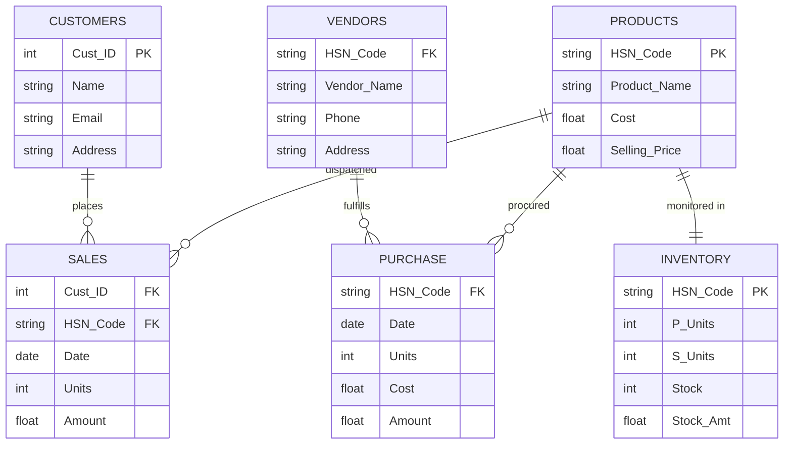

# 📦 Automated Inventory Management & Stock Valuation System

[](https://www.microsoft.com/excel)
[](https://support.microsoft.com/en-us/office/excel-functions-by-category-5f91f4e9-7b42-46d2-9bd1-63f26a86c0eb)
[](https://en.wikipedia.org/wiki/Inventory_management)
[](LICENSE)
[](https://www.linkedin.com/in/harshjadav0901/)

An end-to-end, automated **Inventory Management, Stock Valuation, and Order Processing System** engineered in **Microsoft Excel**.

This solution integrates relational data tables, dynamic lookup pipelines, real-time inventory ledger updates (`Inbound Purchases - Outbound Dispatches = Current Stock`), automated supplier re-order notifications, and an executive KPI analytics dashboard.

---

## 📌 Executive Summary & Key Performance Indicators (KPIs)

| Financial & Operational KPI | Metric Value | Business & Supply Chain Context |
|:---|:---:|:---|
| **Procurement Capital Deployed** | **₹ 55,43,995** | Cumulative purchase volume across authorized hardware & electronics vendors |
| **Gross Sales Revenue** | **₹ 30,71,878** | Top-line revenue generated from enterprise customer dispatches |
| **Realized Net Profit** | **₹ 5,11,980** | Cumulative gross margin earned on completed sales orders |
| **Active Stock Valuation** | **₹ 29,84,097** | Total asset value of current on-hand warehouse inventory at cost |
| **Catalog Products (SKUs)** | **10 Products** | High-value IT equipment, computer peripherals, and consumer tech |
| **Active Enterprise Accounts** | **7 B2B Clients** | Wholesale distributors and corporate procurement accounts |
| **Critical Reorder Alerts** | **4 SKUs** | Items breaching minimum safety threshold ($\le 5\text{ units}$) |
| **Top Revenue Contributor** | **99store (₹ 14.00L)** | Largest enterprise buyer accounting for **$45.6\%$** of total dispatches |

---

## 🖥️ System Architecture & Visual Walkthrough

The system is organized into modular relational workbooks connected via dynamic lookup formulas and automated pivot caches.

### 1. Executive Analytics Dashboard
> Provides real-time financial oversight, warehouse inventory volume, top-selling product rankings, customer revenue distribution, and automated supplier reorder notifications.



#### Key Dashboard Visuals:
- **Executive Metric Cards:** Real-time visibility into Customers ($7$), Products ($10$), Total Purchases ($\text{₹ }55,43,995$), Total Sales ($\text{₹ }30,71,878$), Net Profit ($\text{₹ }5,11,980$), and Total Stock Value ($\text{₹ }29,84,097$).
- **Top 5 Selling Products (Horizontal Bar):** Ranks product velocity led by Desktops ($65\text{ units}$), Speakers ($52\text{ units}$), Headphones ($42\text{ units}$), and RGB Keyboards ($37\text{ units}$).
- **Top 5 B2B Customer Accounts:** Highlights account revenue led by *99store* ($\text{₹ }14.00\text{L}$), *MK Tech* ($\text{₹ }5.80\text{L}$), and *Rajesh Kumar* ($\text{₹ }4.05\text{L}$).
- **Current Available Stock (Column Chart):** Direct visual count of physical warehouse inventory units across all catalog SKUs.
- **Automated Supplier Re-Order Panel:** Dynamic callout card listing low-stock items with direct vendor contact phone numbers.

---

### 2. Real-Time Stock Ledger & Inventory Valuation
> Automated perpetual inventory ledger updating dynamically as purchases and sales transactions are logged.



| HSN Code | Product Name | Cost (₹) | Inbound (P Units) | Outbound (S Units) | Available Stock | Stock Value (₹) | Safety Status |
|:---:|:---|:---:|:---:|:---:|:---:|:---:|:---:|
| `N1001` | Smart Watch | 980 | 40 | 37 | **3** | ₹ 2,940 | ⚠️ Re-Order Required |
| `N1002` | Laptop HP xyz i5 | 34,500 | 30 | 27 | **3** | ₹ 1,03,500 | ⚠️ Re-Order Required |
| `N1003` | Wireless Printer | 4,600 | 40 | 5 | **35** | ₹ 1,61,000 | ✅ Healthy Stock |
| `N1004` | Desktop | 21,000 | 100 | 65 | **35** | ₹ 7,35,000 | ✅ Healthy Stock |
| `N1005` | Mouse | 200 | 20 | 0 | **20** | ₹ 4,000 | ✅ Healthy Stock |
| `N1006` | RGB Keyboard | 340 | 50 | 37 | **13** | ₹ 4,420 | ✅ Healthy Stock |
| `N1007` | Camera | 52,000 | 22 | 8 | **14** | ₹ 7,28,000 | ✅ Healthy Stock |
| `N1008` | Headphones | 799 | 55 | 42 | **13** | ₹ 10,387 | ✅ Healthy Stock |
| `N1009` | Speakers | 670 | 55 | 52 | **3** | ₹ 2,010 | ⚠️ Re-Order Required |
| `N1010` | Tablets | 23,500 | 40 | 37 | **3** | ₹ 70,500 | ⚠️ Re-Order Required |

---

### 3. Transaction Operations (Inbound & Outbound)

```carousel

<!-- slide -->

```

- **Outbound Sales Ledger (`Sales`):** Records customer order transactions, verifies available stock levels, automatically looks up unit selling prices, and calculates line-item billing totals.
- **Inbound Procurement Ledger (`Purchase`):** Tracks supplier consignments, purchase order dates, batch unit costs, and total procurement outflows.

---

## 🏗️ Relational Data Architecture

The Excel workbook functions as a relational database where master records, transactional ledgers, and automated calculation models interact seamlessly:



### Relational Schema Summary

| Table | Role | Key Attributes | Automation Logic |
|:---|:---:|:---|:---|
| **`Products`** | Master | `HSN Code` (PK), `Product Name`, `Cost`, `Selling Price` | Standard catalog pricing reference |
| **`Vendors`** | Master | `HSN Code` (FK), `Vendor Name`, `Phone`, `Address` | Supplier directory linked via HSN Code |
| **`Customers`** | Master | `Cust_ID` (PK), `Name`, `Email`, `Address` | Customer master linked to Sales ledger |
| **`Purchase`** | Transaction | `HSN Code` (FK), `Date`, `Units`, `Cost`, `Amount` | Increments inventory via `SUMIFS` |
| **`Sales`** | Transaction | `Cust_ID` (FK), `HSN Code` (FK), `Units`, `Stock`, `Amount` | Decrements inventory; validates stock |
| **`Inventory`** | Ledger | `HSN Code` (PK), `P Units`, `S Units`, `Stock`, `Stock Amt` | Auto-calculates stock balance & valuation |

---

## 🧮 Core Formula Engineering

The inventory engine operates entirely on native Excel formulas without requiring manual intervention:

```excel
-- 1. Real-Time Inbound Stock Quantity (Purchased Units)
=SUMIFS(Purchase!E:E, Purchase!A:A, Inventory!A6)

-- 2. Real-Time Outbound Stock Quantity (Sold Units)
=SUMIFS(Sales!G:G, Sales!C:C, Inventory!A6)

-- 3. Net On-Hand Inventory Balance
=Inventory!D6 - Inventory!E6

-- 4. Current Stock Valuation Asset (At Cost)
=Inventory!F6 * Inventory!C6

-- 5. Automated Low-Stock Re-Order Alert (Threshold <= 5 units)
=IF(Inventory!F6<=5, CONCATENATE("📞 ", Inventory!B6, " Needs To Re-Order ! PH. ", VLOOKUP(Inventory!A6, Vendors!A:E, 4, FALSE)), "")

-- 6. Dynamic Pricing Lookup in Sales Ledger
=VLOOKUP(Sales!C6, Products!A:D, 4, FALSE) * Sales!G6
```

---

## 💡 Key Supply Chain Insights & Operational Recommendations

```
INVENTORY CAPITAL DISTRIBUTION (₹)
================================================================================
Desktops          ₹ 7,35,000 ████████████████████ (24.6% of Stock Capital)
Cameras           ₹ 7,28,000 ███████████████████  (24.4% of Stock Capital)
Wireless Printers ₹ 1,61,000 ████                 (5.4% of Stock Capital)
HP Laptops        ₹ 1,03,500 ███                  (3.5% of Stock Capital)
Tablets           ₹   70,500 █                    (2.4% of Stock Capital)
Other SKUs        ₹   20,097 ▏                    (0.7% of Stock Capital)
================================================================================
```

1. **Working Capital Concentration in High-Ticket Electronics:**
   - Two categories—**Desktops (₹ 7.35L)** and **Cameras (₹ 7.28L)**—represent **$49.0\%$** of all locked inventory capital (₹ 14.63L of ₹ 29.84L total).
   - **Recommendation:** Maintain strict just-in-time (JIT) ordering cycles for cameras to release working capital.

2. **Immediate Supplier Reorders Required:**
   - Four high-demand products have dropped to **3 remaining units** (critical threshold $\le 5$):
     - **Smart Watches** ($3\text{ units left}$)
     - **HP Laptops** ($3\text{ units left}$)
     - **Speakers** ($3\text{ units left}$)
     - **Tablets** ($3\text{ units left}$)
   - **Recommendation:** Trigger purchase orders immediately using the automated notification contact details (`Tech99` and `Compac`).

3. **Customer Concentration Management:**
   - The top customer, **99store**, accounts for **₹ 14,00,292 ($45.6\%$)** of all sales revenue.
   - **Recommendation:** Introduce tiered credit terms and volume discount agreements to safeguard relationship continuity while diversifying customer acquisition.

---

## 📂 Repository Structure

```text
Inventory-Management-System/
├── assets/
│   ├── inventory_dashboard.png       # Executive KPI dashboard & re-order notification preview
│   ├── stock_inventory_status.png    # Real-time stock valuation & perpetual ledger preview
│   ├── sales_transactions.png        # Sales dispatch tracking & order processing preview
│   └── purchase_orders.png           # Inbound procurement & vendor order preview
├── dashboards/
│   └── inventory management system.xlsx  # Core automated Excel inventory tracking system
├── data/
│   ├── products.csv                  # Catalog master data (HSN, Name, Cost, Price)
│   ├── customers.csv                 # Customer account registry (ID, Name, Contact)
│   ├── vendors.csv                   # Supplier directory (HSN, Vendor, Phone)
│   ├── purchases.csv                 # Inbound procurement transaction log
│   ├── sales.csv                     # Outbound customer sales order log
│   └── inventory_status.csv          # Stock snapshot with unit counts and valuation
├── .gitignore                        # Excludes temporary Excel lockfiles & system artifacts
├── LICENSE                           # MIT Open-Source License
└── README.md                         # Executive project documentation & system guide
```

---

## 🚀 How to Use the Inventory Management System

1. **Clone the Repository:**
   ```bash
   git clone https://github.com/jadavharsh109/Inventory-Management-System.git
   ```
2. **Open the System:**
   - Launch `dashboards/inventory management system.xlsx` in **Microsoft Excel 2016+** or **Microsoft 365**.
3. **Daily Operations Workflow:**
   - **Add Catalog Items:** Enter new items in the `Products` sheet and map vendor details in `Vendors`.
   - **Log Incoming Stock:** Enter inbound shipments in `Purchase`.
   - **Log Customer Sales:** Enter orders in `Sales` (stock is deducted automatically).
   - **Monitor Real-Time Balances:** Open `Inventory` to review stock availability and `Dashboard` for KPI metrics and re-order alerts.

---

## 👤 Author & Contact

**Harsh Jadav**  
*Data Analyst | Data Scientist*

[](https://www.linkedin.com/in/harshjadav0901/)
[](https://github.com/jadavharsh109)

---
*If this inventory tracking system is helpful for your supply chain analytics, don't forget to give it a ⭐ star!*
